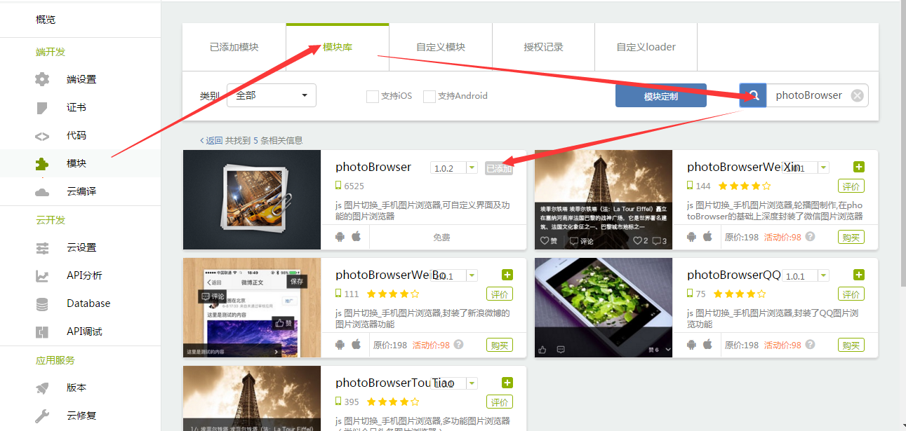

# README

## DEMO 运行流程说明

- 在云端 [APICloud](https://www.apicloud.com) 的控制台新创建一个Native应用
	
	

- 根据下面提供的**使用模块列表**，将对应的模块添加到应用
	
	

- 使用 [APICloud Studio2](https://www.apicloud.com/devtools) 或其他 SVN工具将新建的应用代码从云端下载到本地
	
	

- 下载本 DEMO 的源代码，使用 DEMO 源码覆盖上面新建的应用代码（注意在config.xml中使用新建应用的appId）

- 将代码保存并同步到云端
	
	

- 在 [APICloud](https://www.apicloud.com) 控制台云编译本项目
	
	
	
- 使用手机扫描二维码下载安装本项目，即可查看 DEMO 的运行效果

## 使用模块列表

- [photoBrowser](https://docs.apicloud.com/Client-API/Func-Ext/photoBrowser)
	
	photoBrowser 是一个图片浏览器，支持单张、多张图片查看的功能，可放大缩小图片，支持本地和网络图片资源。若是网络图片资源则会被缓存到本地，缓存到本地上的资源可以通过 clearCache 接口手动清除。同时本模块支持横竖屏显示，在本app支持横竖屏的情况下，本模块底层会自动监听当前设备的位置状态，自动适配横竖屏以展示图片。使用此模块开发者看实现炫酷的图片浏览器。